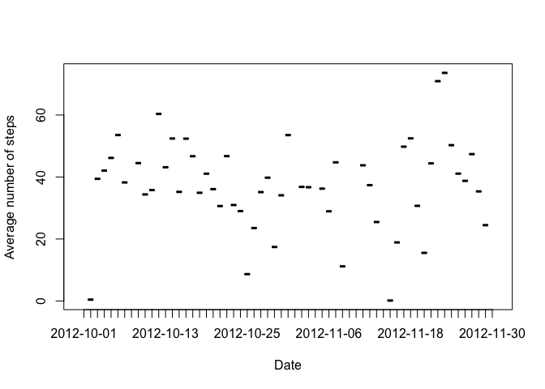
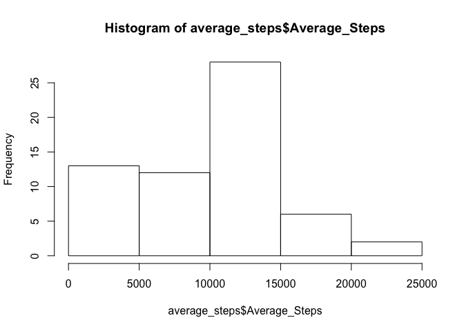

# Reproducible Research: Peer Assessment 1


## Loading and preprocessing the data

```r
step_data <- read.csv("activity.csv")
step_data <- subset(step_data, !is.na(steps))
```


## What is mean total number of steps taken per day?

```r
steps_per_day <- aggregate(step_data$steps, by=list(Date=step_data$date), FUN=sum)
names(steps_per_day) <- c("Date", "Steps")
hist(steps_per_day$Steps, xlab="Steps", main="Step Frequency")
```

 


```r
mean_step <- as.integer(mean(steps_per_day$Steps))
```
The mean total number of steps taken per day is: 10766


```r
median_step <- as.integer(median(steps_per_day$Steps))
```
And the median total number of steps taken per day is: 10765

## What is the average daily activity pattern?

```r
average_steps <- aggregate(step_data$steps, by=list(Date=step_data$date), FUN=mean)
plot(average_steps, type="l", ylab="Average number of steps")
```

 

The highest average number of steps was on 2012-11-24.

## Imputing missing values

```r
step_data <- read.csv("activity.csv")
nas <- subset(step_data, is.na(steps))
na_rows <- nrow(nas)
```
There are 2304 rows containing NA values.


```r
step_data$steps <- apply(step_data, 1, function(row) if(is.na(row[1])) { 0 } else { as.numeric(row[1]) })
total_steps <- aggregate(step_data$steps, by=list(Date=step_data$date), FUN=sum)
names(total_steps) <- c("Date", "Steps")
average_steps <- aggregate(total_steps$Steps, by=list(Date=total_steps$Date), FUN=mean)
names(average_steps) <- c("Date", "Average_Steps")
hist(average_steps$Average_Steps)
```

 

```r
mean_step <- as.integer(mean(average_steps$Average_Steps))
median_step <-as.integer(median(average_steps$Average_Steps))
```

The new mean steps is 9354.
The new median steps is 10395.

The new mean and median are different from the earlier estimates. The effect of imputing missing data caused the mean and median to shift towards zero.

## Are there differences in activity patterns between weekdays and weekends?


```r
average_steps$wd <- apply(average_steps, 1, function(row) if(weekdays(as.Date(row[1])) == "Saturday" || weekdays(as.Date(row[1])) == "Sunday") { "Weekend" } else { "Weekday" })
```
