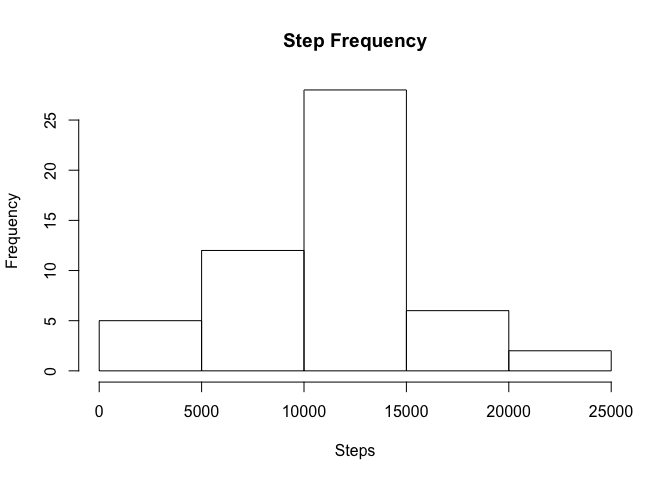

# Reproducible Research: Peer Assessment 1


## Loading and preprocessing the data

```r
step_data <- read.csv("activity.csv")
step_data <- subset(step_data, !is.na(steps))
```


## What is mean total number of steps taken per day?

```r
steps_per_day <- aggregate(step_data$steps, by=list(Date=step_data$date), FUN=sum)
names(steps_per_day) <- c("Date", "Steps")
hist(steps_per_day$Steps, xlab="Steps", main="Step Frequency")
```

 

The mean total number of steps taken per day is:

```r
mean(steps_per_day$Steps)
```

```
## [1] 10766.19
```

And the median total number of steps taken per day is:

```r
median(steps_per_day$Steps)
```

```
## [1] 10765
```

## What is the average daily activity pattern?


## Imputing missing values


## Are there differences in activity patterns between weekdays and weekends?
